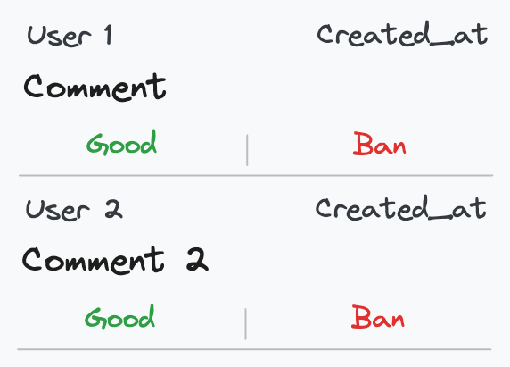

# Forum API

Based on the task, I assume the main purpose of the system is to moderate messages to prevent inappropriate content. Therefore, I suggest building a screen with all not moderated comments by all users. The list is sorted by comment ID in ascending order because we don't want a comment to remain unmoderated for a long period of time, and the real order based on created_at is not really important.

Using this approach, we can easily precompute all waiting for moderation comments, store them and respond to a client without unnecessary joins and filters.



## Content
- [Authentication](#authentication)
- [Data Format](#data-format)
- [Rate limit](#rate-limit)
- [Response Codes](#response-codes)
- Endpoints
  - [Comments Feed](#comments-feed)
  - [Ban User](#ban-user)
  - [Remove comment from the list](#remove-comment-from-the-list)
  - [List of all users](#list-of-all-users)
  - [List of all comments by user](#list-of-all-comments-by-user)

## Authentication
All requests must be authenticated using JWT (JSON Web Token). The token is passed in the **Authorization header** as ``Bearer jwt_token``.

## Data Format
``JSON``

## Rate Limit
| Request Type              | Limit per 1 second    |
|---------------------------|-----------------------|
| GET                       | 5                    |
| POST                      | 1                     |

## Response Codes
| Code                      | Description                              |
|---------------------------|------------------------------------------|
| 200 OK                    | Successful request                       |
| 401 Unauthorized          | Authentication error                     |
| 403 Forbidden             | Access denied (insufficient permissions) |
| 404 Not Found             | Resource not found                       |
| 429 Too Many Requests     | Rate limit exceeded                      |
| 500 Internal Server Error | Internal server error                    |

## Endpoints

- ### Comments Feed
Get list of all waiting for moderation comments.

#### Request
``GET v1/moderation/comments``

#### Params
- ``since_id`` (integer, optional) - Used for a keyset pagination. If not provided, returns the first *n* waiting for moderation comments.
- ``limit`` (integer, optional) - Limit on the number of comments to return. If not provided, the default value is 20. Ranging between 1 and 100.

#### Response
```ruby
{
  "since_id": integer,
  "limit": integer,
  "comments": [
    {
      "id": integer,
      "content": string,
      "created_at": string, ISO 8601 datetime format,
      "user_id": integer,
      "user_name": string  
    }
  ]
}
```

#### Example
```curl
curl -X GET "https://example.com/v1/moderation/comments?since_id=123&limit=50" \
-H "Authorization: Bearer jwt_token"
```
```ruby
{
  "since_id": 123,
  "limit": 50,
  "comments": [
    {
      "id": 124,
      "content": "Comment 1",
      "created_at": "2024-07-22T17:50:13.513+03:00",
      "user_id": 42,
      "user_name": "User 1"  
    }
  ]
}
```

---
- ### Ban User
Ban user by a given id.

#### Request
``PUT v1/moderation/users/:id/ban``

#### Params
- ``id`` (integer, required) - User id.

#### Example
```curl
curl -X PUT "https://example.com/v1/users/42/ban" \
-H "Authorization: Bearer jwt_token"
```

---
- ### Remove comment from the list
Remove a comment from the list of comments awaiting moderation. Client sends this request immediately if the comment is appropriate or after a successful user ban. 

> We could remove the comment within the ban request to reduce the number of requests to a server. However, this behavior is not so obiouse and could potentially lead to unpredictable situations in the future. Overall, it is a point worth discussing.

#### Request
``DELETE v1/moderation/comments/:id``

#### Params
- ``id`` (integer, required) - Comment id.

#### Example
```curl
curl -X DELETE "https://example.com/v1/moderation/comments/124" \
-H "Authorization: Bearer jwt_token"
```
---
- ### List of all users
Get all users

#### Request
``GET v1/moderation/users``

#### Params
- ``limit`` (integer, optional) - Limit on the number of users to return. Ranging between 1 and 100. If not provided, the default value is 20.
- ``offset`` (integer, optional) - Offset on the number of users to return. If not provided, the default value is 0.

#### Response
```ruby
{
  "limit": integer,
  "offset": integer,
  "total_number": integer,
  "users": [
    {
      "id": integer,
      "name": string
    }
  ]
}
```

#### Example
```curl
curl -X GET "https://example.com/v1/moderation/users?limit=50&offset=100" \
-H "Authorization: Bearer jwt_token"
```
```ruby
{
  "limit": 50,
  "offset": 100,
  "total_number": 500,
  "users": [
    {
      "id": 42,
      "name": "User 1"
    }
  ]
}
```

---

- ### List of all comments by user
Get all comments by a given user

#### Request
``GET v1/moderation/users/:id/comments``

#### Params
- ``id`` (integer, required) - User id.
- ``limit`` (integer, optional) - Limit on the number of comments to return. Ranging between 1 and 100. If not provided, the default value is 20.
- ``offset`` (integer, optional) - Offset on the number of comments to return. If not provided, the default value is 0.

#### Response
```ruby
{
  "limit": integer,
  "offset": integer,
  "total_number": integer,
  "user_id": integer,
  "comments": [
    {
      "id": integer,
      "content": string,
      "created_at": "2024-07-22T17:50:13.513+03:00"
    }
  ]
}
```

#### Example
```curl
curl -X GET "https://example.com/v1/moderation/users/42/comments?limit=10&offset=20" \
-H "Authorization: Bearer jwt_token"
```
```ruby
{
  "limit": 10,
  "offset": 20,
  "total_number": 50,
  "user_id": 42,
  "comments": [
    {
      "id": 124,
      "content": "Comment 1",
      "created_at": "2024-07-22T17:50:13.513+03:00"
    }
  ]
}
```
